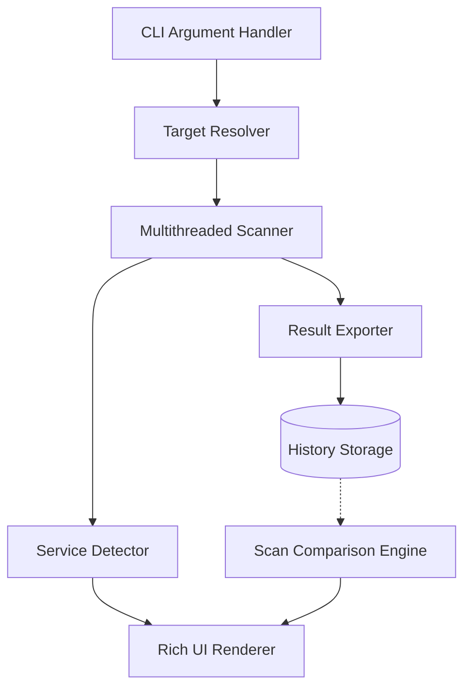

# 🔍 PortSight

**A high-speed, multithreaded network reconnaissance tool for rapid discovery and differential port analysis.**

[](https://github.com/geevarghesekthomas84-sys/PortSight/actions/workflows/tests.yml)
[](https://opensource.org/licenses/MIT)
[](https://www.python.org/downloads/)

PortSight is a professional-grade, high-performance multithreaded TCP port scanner designed for security auditors and network enthusiasts. It combines the raw speed of Python's `socket` library with a sophisticated, modern CLI experience.

---

## 📺 Demo

```ansi
 [38;5;33m╭─────────────────────────────────────────────────────────────────╮ [0m
 [38;5;33m│ [0m [38;5;51m [1m                                                                 [0m [38;5;33m│ [0m
 [38;5;33m│ [0m [38;5;51m [1m    ____                 __  _____ _       __    __            [0m [38;5;33m│ [0m
 [38;5;33m│ [0m [38;5;51m [1m   / __ \____  _________/ /_/ ___/(_)___ _/ /_  / /_           [0m [38;5;33m│ [0m
 [38;5;33m│ [0m [38;5;51m [1m  / /_/ / __ \/ ___/ __  / /\__ \/ / __ `/ __ \/ __/           [0m [38;5;33m│ [0m
 [38;5;33m│ [0m [38;5;51m [1m / ____/ /_/ / /  / /_/ / /___/ / / /_/ / / / / /_            [0m [38;5;33m│ [0m
 [38;5;33m│ [0m [38;5;51m [1m/_/    \____/_/   \__,_/_//____/_/\__, /_/ /_/\__/            [0m [38;5;33m│ [0m
 [38;5;33m│ [0m [38;5;51m [1m                                 /____/                       [0m [38;5;33m│ [0m
 [38;5;33m│ [0m [38;5;51m [1m                                                                 [0m [38;5;33m│ [0m
 [38;5;33m╰─────────────────────────── [0m [38;5;33m [1m [38;5;33m [1mv1.0.0 [0m [38;5;33m [1m [38;5;33m [0m [38;5;33m───╯ [0m
 [1;34m[INFO] [0m Target:  [1;36mscanme.nmap.org [0m
 [1;34m[INFO] [0m Resolved Address:  [1;36m45.33.32.156 [0m
 [1;34m[INFO] [0m Hostname:  [1;36mscanme.nmap.org [0m

 [1;36mScanning 1024 ports... [0m  [33m━━━━━━━━━━━━━━━━━━━━━━━━━━━━━━━━━━━━━━━━ [0m  [1;36m100% [0m  [34m0:00:12 [0m

 [1;36m                           Scan Results                             [0m
 [38;5;250m╭────────┬────────┬────────────┬────────────────────────────┬──────────╮ [0m
 [38;5;250m│ [0m [1;32m   PORT  [0m [38;5;250m│ [0m [1;36m STATUS  [0m [38;5;250m│ [0m [1;33m SERVICE     [0m [38;5;250m│ [0m [3m BANNER/IDENTIFICATION        [0m [38;5;250m│ [0m [38;5;250m TIME      [0m [38;5;250m│ [0m
 [38;5;250m├────────┼────────┼────────────┼────────────────────────────┼──────────┤ [0m
 [38;5;250m│ [0m [1;32m     22  [0m [38;5;250m│ [0m [1;36m  OPEN   [0m [38;5;250m│ [0m [1;33m SSH         [0m [38;5;250m│ [0m [3m SSH-2.0-OpenSSH_9.2p1 Debian  [0m [38;5;250m│ [0m [38;5;250m 02:22:15  [0m [38;5;250m│ [0m
 [38;5;250m│ [0m [1;32m     80  [0m [38;5;250m│ [0m [1;36m  OPEN   [0m [38;5;250m│ [0m [1;33m HTTP        [0m [38;5;250m│ [0m [3m Apache/2.4.54 (Debian)        [0m [38;5;250m│ [0m [38;5;250m 02:22:15  [0m [38;5;250m│ [0m
 [38;5;250m╰────────┴────────┴────────────┴────────────────────────────┴──────────╯ [0m
```

---

## 🏗️ Architecture



---

## ✨ Key Features

- **🚀 Concurrent Performance**: Leverages `ThreadPoolExecutor` for high-speed analysis.
- **📊 HTML Reporting**: Generate professional, enterprise-grade HTML reports with `--report`.
- **🛡️ Security Insights**: Automatic detection of risky ports with categorized alerts (Critical, Warning, Info).
- **🔄 Scan Comparison**: Detect newly opened or closed ports by comparing with baseline scans.
- **🏗️ Global CLI**: Install as a standalone tool with `pip install .`.
- **🎨 Polished UX**: Beautiful terminal output with stylized ASCII branding and real-time progress bars.

---

## 🧠 What I Learned
- **Reporting Architecture**: Designing a clean HTML/CSS template to provide value without UI bloat.
- **Security Logic**: Mapping common network vulnerabilities to actionable insights.
- **Modern Packaging**: Using `pyproject.toml` to transition from a script to a global CLI utility.
- ** structural Design**: Maintaining modularity while adding complex features like differential analysis.

---

## 🚀 Installation & Usage

### Installation (Global CLI)
```bash
# Clone the repository
git clone https://github.com/geevarghesekthomas84-sys/PortSight.git
cd PortSight

# Install as a global tool
pip install .
```

### Basic Scan
```bash
portsight scanme.nmap.org
```

### Professional HTML Report
```bash
portsight 192.168.1.1 --ports 1-1024 --report report.html
```

### Scan & JSON Export (for history)
```bash
portsight 192.168.1.1 --output baseline.json
```

### Differential Analysis (Comparison)
```bash
portsight 192.168.1.1 --compare baseline.json --report diff_report.html
```

---

## 💼 Why This Project Matters

In cybersecurity, **visibility is protection**. PortSight demonstrates the fundamentals of network reconnaissance:
1. **Asset Discovery**: Identifying reachable services and tracking surface area.
2. **Vulnerability Management**: Detecting unauthorized open ports or outdated service banners.
3. **Configuration Audit**: Monitoring for "drift" in server setups over time using differential analysis.

---


### Installation
```bash
pip install -r requirements.txt
```

### Basic Scan
```bash
python main.py scanme.nmap.org
```

### Scan & Export
```bash
python main.py 192.168.1.1 --ports 1-100 --output baseline.json
```

### Compare Scans (Differential Analysis)
```bash
python main.py 192.168.1.1 --ports 1-100 --compare baseline.json
```

---

## ⚠️ Disclaimer

**Authorized use only.** PortSight is for educational and legal security testing. Unauthorized scanning of networks is strictly prohibited. The developer assumes no liability for any misuse of this tool.

---

## 📄 License

Distributed under the **MIT License**. See `LICENSE` for more information.
